# DCS 數位電路與系統 — 期末考整理（2022 + 2025）

> 來源：`2022dcs_final.pdf`、`2025_DCS_Final_Exam.pdf`、`2025_DCS_Final_Exam_ans.pdf`
> 2025 附官方解答（紅字），2022 無解答（本檔解析為自行推導，標註「⊳推導」）。
> 內文已嵌入原卷的電路圖、FSM 表、波形格、程式碼、timing report 等圖片（存於 `images/`）。
> Metastability / CDC 段落（知識點 G）參考 `Lab/2026_DCS_Lab09.pptx`，並引用其投影片圖。

---

## 0. 兩年考點對照表（Topic Map）

這門課每年題型高度重複，幾乎是固定 8 大主題。掌握下表即涵蓋全部：

| # | 主題 | 2022 | 2025 | 重要度 |
|---|------|------|------|--------|
| A | **Pipeline / Parallelism**（切 register、cycle time、throughput、latency、utilization） | Q1, Q11 | Q1, Q7 | ★★★★★ 必考 |
| B | **Timing Report 判讀**（critical path、slack、setup/hold violation） | Q2(b)(c) | Q2, Q6(a)(b) | ★★★★★ 必考 |
| C | **Block diagram ↔ RTL 互轉** | Q2(a) | Q6(d) | ★★★★ |
| D | **Waveform 畫圖**（FSM code → 波形） | Q3 | Q8 | ★★★★★ 必考 |
| E | **Setup/Hold time violation 計算** | Q12 | Q9 | ★★★★★ 必考 |
| F | **SRAM 擴充**（width/depth、多 port） | Q7, Q8 | Q4 | ★★★★ |
| G | **CDC / Metastability / Synchronizer / Gray code** | Q9 | Q5 | ★★★★ |
| H | **Microcode FSM**（ROM table） | Q10 | Q3 | ★★★ |
| I | **FPGA vs ASIC、valid-ready handshake** | Q4,5,6 | — | ★★ |

---

# 一、核心知識點與公式（先背這些）

## A. Pipeline / Parallelism

**切 pipeline register 的原則**：把 register 插在能讓「最長一段組合邏輯 delay」最小的位置 → **平衡各 stage delay**（balance the stages）。critical path = 最慢的那一段。

- **Cycle time（含 setup）**：`T_clk ≥ max(stage delay) + t_setup`
- **Throughput** = 1 / cycle time（每 cycle 一筆輸出，pipeline 填滿後）。若每筆需 N 個 operation：`throughput = N operations / cycle time`
- **Latency**（總延遲，從輸入到該筆輸出）：
  - 未 pipeline：`= 組合邏輯總 delay`
  - pipeline 後：`= 階數 × cycle time`（通常 **變長或不變，不會變短**！pipeline 提升 throughput，犧牲 single-item latency）
- **Hardware utilization** = 該 stage 實際忙碌時間 / 總時間。瓶頸 stage（最長）= 100%，其餘 = 自身 delay / 瓶頸 delay。
- **平衡 utilization 的切法**：把長 stage 切成多個等長子 stage，使每段 delay 一致 → 全部 100%。
- **避免 stall**：可變延遲 / 瓶頸 stage → 用 **FIFO buffer** 或 **複製（replicate）該 stage 硬體** 輪流處理。
- **Pipeline vs Replication**：pipeline 省面積但 latency 高；replication（平行複製整個 module）面積大但每份獨立。實務常 **replicated pipeline**（兩者並用）。

## B. Timing Report 判讀

```
data arrival time   = launch clk delay + CK→Q + 組合邏輯 delay
data required time  = clk period + capture clk delay − uncertainty − setup
slack = data required − data arrival      ( ≥0 = MET, <0 = VIOLATED )
```
- **Startpoint / Endpoint**：報告開頭直接寫明（launch FF / capture FF 或 input/output port）。
- **slack MET 不代表最小週期 = 週期−slack**：合成工具在更緊的 constraint 下會換不同 cell/架構，最小週期通常**還能更低**，不能直接相減。
- **reg-to-reg path 五段**（2025 Q2 標 a~e）：
  `a` launch clk network delay → `b` launch FF CK→Q → `c` 組合邏輯雲 → `d` capture clk network delay → `e` library setup time。

## E. Setup / Hold Time 檢查（最常算錯，務必熟）

```
Setup check（決定最快 clock）： T_c ≥ t_pcq + t_pd(max) + t_setup
Hold  check（與 clock 無關）：  t_ccq + t_cd(min) ≥ t_hold
```
- `t_pcq`=propagation clk→Q（max）, `t_ccq`=contamination clk→Q（min）
- `t_pd`=邏輯 propagation delay（max）, `t_cd`=邏輯 contamination delay（min）
- **Hold violation 解法**：在快路徑（短路徑）上 **加 delay（buffer）** 使 `t_ccq + t_cd + Δ ≥ t_hold`。加 delay 會吃進 setup 餘裕。
- **Hold 違反與頻率無關**，加快 clock 不會解決也不會惡化 hold。

## F. SRAM 擴充（重點擴充）

### F-0. 先看懂規格：`深度 × 寬度` = words × bits/word

以 **1K×8** 為例：
- **深度 = 1K = 1024 個 word** → address 需要 `log₂(1024) = 10` 條（A[9:0]）。**address 條數決定深度。**
- **寬度 = 8 bit/word** → data bus 8 條。**data 條數決定寬度。**

所有擴充題都在問：手上只有「1K×8 這種小積木」，要怎麼**堆出更大/更多功能的記憶體**。先記住一句話：

> **加寬 = 要每個 word 更多 bit；加深 = 要更多個 word；多 port = 要一個 cycle 能多次存取。**

---

### F-1. 加寬（widen）：每個 word 要更多 bit，word 數量不變

例：用 1K×8 組出 **1K×32**（一樣 1024 個 word，但每個 word 從 8 bit → 32 bit）。

**做法：4 顆並聯，全部同時動作、共用同一個 address，輸出「拼接」成 32 bit。**

```
            A[9:0]  ← 4 顆共用「同一組位址」
       ┌──────┼──────┬──────┬──────┐
       ▼      ▼      ▼      ▼
    ┌─────┐┌─────┐┌─────┐┌─────┐
    │1K×8 ││1K×8 ││1K×8 ││1K×8 │   ← 4 顆都是 active
    └──┬──┘└──┬──┘└──┬──┘└──┬──┘
   D[7:0] D[15:8] D[23:16] D[31:24]
       └──────┴───┬──┴──────┘
                  ▼
              D[31:0]   ← 32-bit 輸出（4×8 直接接在一起）
```

- **直覺**：像把 4 本筆記本並排，翻到**同一頁碼**，每本各抄一段 → 湊成更長的一列。
- **address 不變（仍 10 條）、data 變寬（8→32）、不需要額外邏輯**（純接線拼接，寫入時把 32-bit 資料切 4 段分別餵）。

---

### F-2. 加深（deepen）：要更多 word，寬度不變

例：用 1K×8 組出 **4K×8**（4096 個 word，每個仍 8 bit）。

4096 個 word 需要 `log₂(4096) = 12` 條 address（A[11:0]）。但每顆只吃 10 條（A[9:0]），**多出來的高 2 位 A[11:10] 拿來「選哪一顆」**。

**做法：4 顆堆疊，一次只有一顆 active，用高位元當 bank select。**

```
   A[11:10] ─► 2-to-4 decoder ─► 各顆 CE（同一時間只 1 顆被選中）
   A[9:0] ────┬──────┬──────┬──────┐   ← 低位元送到「每一顆」
              ▼      ▼      ▼      ▼
          ┌─────┐┌─────┐┌─────┐┌─────┐
  bank0 → │1K×8 ││1K×8 ││1K×8 ││1K×8 │ ← bank3
          └──┬──┘└──┬──┘└──┬──┘└──┬──┘
             └──────┴──┬───┴──────┘
                       ▼  4-to-1 MUX（sel = A[11:10]）
                   D[7:0]   ← 8-bit（寬度不變，但深度 ×4）
```

- **直覺**：像把 4 本筆記本疊起來，`A[11:10]` 先決定**翻哪一本**，`A[9:0]` 再決定**翻到第幾頁**。同一時間只看一本。
- **address 變多（10→12）、data 不變、需要 decoder + 輸出端 MUX**。

---

### F-3. 加寬 vs 加深 一表對照（最容易混）

| | **加寬 (widen)** | **加深 (deepen)** |
|---|---|---|
| 目標 | word 變寬（bit 數 ↑） | word 變多（數量 ↑） |
| 例 | 1K×8 → 1K×**32** | 1K×8 → **4K**×8 |
| 接法 | **並聯**，4 顆同時動 | **堆疊**，一次只動 1 顆 |
| address | **不變**（同一組送全部） | **變多**（高位選 bank） |
| data | **變寬**（輸出拼接） | **不變** |
| 額外邏輯 | 幾乎沒有（只拼線） | **decoder + MUX** |

---

### F-4. 多 port：一個 cycle 要能同時存取多次

基本 SRAM 是 **單 port**＝一個 cycle 只能「一讀」**或**「一寫」。多 port 題要做到一個 cycle 兩次（或更多）存取。用單 port 積木有兩招：

**(招 1) 分 bank（address space 切開）** — 用在「保證兩 port 打不同位址範圍」時（2025 Q4(c)）：
- 把 2K×8 拆成兩塊 1K×8：Bank0 = 位址 0~1023、Bank1 = 1024~2047，用 **最高位 A[10] 區分**。
- 每個 port 依自己位址的 MSB，透過 MUX 路由到對應的 bank。題目保證兩 port **不會同時打同一塊** → 兩塊各自獨立做單 port 存取，**同 cycle 互不衝突**。

```
   Port A (addr_a)              Port B (addr_b)
        │ MSB=a[10]                  │ MSB=b[10]
        └────────►  routing MUX  ◄───┘   （依各 port MSB 決定連哪塊）
                   ▼            ▼
              ┌─────────┐  ┌─────────┐
              │ Bank0   │  │ Bank1   │
              │ 1K×8    │  │ 1K×8    │
              │ 0~1023  │  │1024~2047│
              └─────────┘  └─────────┘
   兩 port 落在不同 bank → 同 cycle 一讀一寫 / 兩讀 / 兩寫都 OK
```

**(招 2) 複製記憶體（replication）** — 用在「要多個同時**讀**」時（2022 Q8 風格）：
- 想支援 N 個同時讀 → 放 **N 份相同 copy**，每個讀 port 連到不同 copy（各自獨立讀）。
- **寫入時要同步寫進「所有 copy」**，確保每份內容一致。
- 代價：面積 ×N（讀越多 port 越貴）。

> **判斷用哪招**：題目說「兩 port 不會同時打同一位址/分兩個 address space」→ **分 bank**（省面積）。題目要「任意位址都能多重**讀**」→ **複製**。要任意位址多重**寫**就只能更貴的真多 port cell。

## G. Metastability / CDC / Synchronizer（重點擴充，參考 Lab09 - CDC）

> 這是期末考必考觀念題（2022 Q9、2025 Q5）。Lab09 整個就在做 CDC / Async FIFO，內容直接對應，務必弄懂下面 5 個層次。

### G-1. Clock Domain Crossing (CDC) 是什麼

- **定義**：資料的 **launch（送出）與 capture（接收）由兩個不同、非同步的 clock domain 完成**，就稱為 CDC。
- 兩個非同步 clock 之間**沒有固定相位關係**，目標 clk 的有效邊緣**可能剛好落在來源資料正在跳變的瞬間** → 無法保證滿足接收 FF 的 setup/hold。
- 範例：clk1 週期 13、clk2 週期 10，兩者邊緣相對位置一直漂移，遲早撞進 setup/hold window：

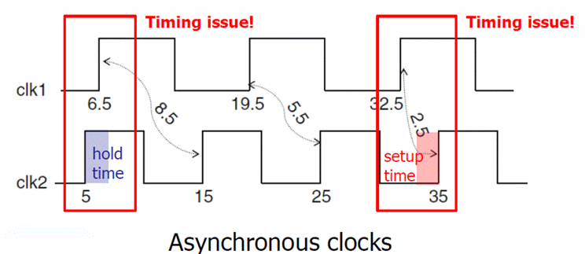

### G-2. Metastability（亞穩態）

- **定義**：因資料在 setup/hold window 內跳變（non-ideal transition），FF 輸出 q **進入既不是穩定 0、也不是穩定 1 的不穩定態**，需要一段**不確定長度的時間**才會 resolve 到 0 或 1（甚至可能 resolve 到錯的值）。
- 物理類比：球停在山頂，最終會滾向某一邊，但**滾下來的時間不定**。下圖 q 在取樣後出現多條不同的結算軌跡：

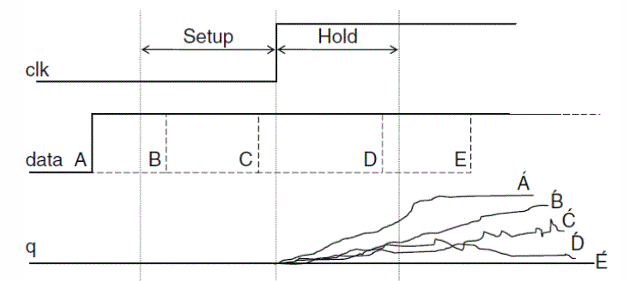

- 在**單一同步設計**中，靠滿足 setup/hold 即可避免；但 **CDC 必然會遇到**，無法完全消除，只能把它「傳播到下游的機率」壓到極低。
- **MTBF（Mean Time Between Failures）**——衡量多久才出一次亞穩態錯誤：

  > **MTBF ＝ e^(t_r / τ) ／ ( T0 × f_clk × f_data )**

  - `t_r`＝留給亞穩態 resolve 的時間、`τ`＝FF 的亞穩態時間常數、`T0`＝亞穩態窗口、`f_clk/f_data`＝接收時脈/資料切換頻率。
  - 關鍵：**t_r 與 MTBF 成指數關係** → 只要多給亞穩態一點時間 resolve，可靠度就暴增。這正是 2-FF synchronizer 的原理。

### G-3. Brute-Force Synchronizer（2-FF 雙寄存器同步器）

- **結構**：`A →[FF1]→ AW →[FF2]→ AS`，兩級 FF 都用**目標 domain 的 clk**。

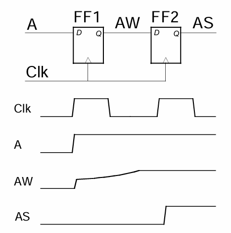

- **原理**：FF1 取到 CDC 訊號時 AW 可能亞穩（抖動），但 **FF1→FF2 之間有將近一整個 clk cycle** 讓 AW 慢慢 resolve；等 FF2 取樣時，AW 幾乎一定已穩定 → 輸出 AS 乾淨。等於把 MTBF 公式裡的 `t_r` 拉長到接近一個 cycle → MTBF 指數級上升。
- **代價**：+1 cycle latency；機率上仍非 100%（殘餘失敗率極小），極端要求可用三級。
- **⚠️ 只適用單 bit！** 多 bit 訊號不能每個 bit 各自獨立丟 2-FF（理由見 G-4）。

### G-4. 多 bit 的 Convergence 問題 → 為何要用 Gray code

- 多 bit 同時跨域時，各 bit 經過的繞線/閘延遲不同，**無法保證所有 bit 在同一個 clk 同時被取樣到**；可能某些 bit 已更新、某些還是舊值 → 讀到**錯誤的中間值**（re-convergence）。

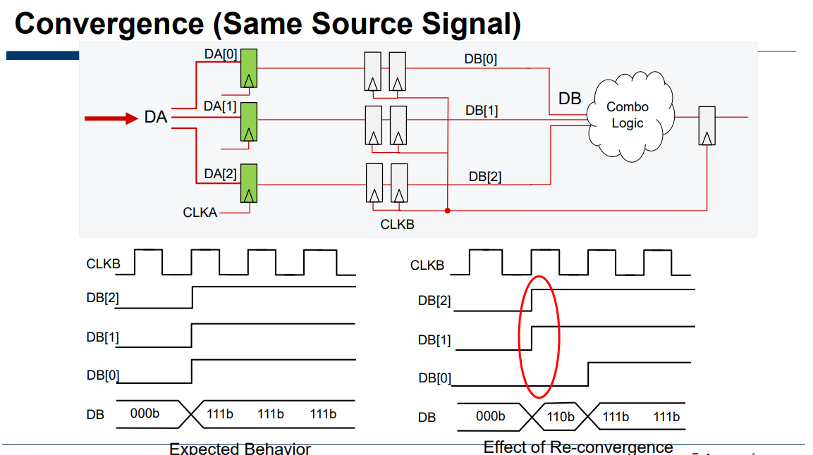

- 例：二進位 `011→100`，三個 bit 同時翻轉；若取樣瞬間只更新到部分 bit，可能讀到 `000`、`111` 等完全錯誤的值。
- **Gray code 解法**：相鄰碼**只差 1 個 bit**。即使取樣落在轉態瞬間，最多只有那 1 個 bit 不確定 → 結果**不是舊值就是新值（最多差 1）**，不會亂跳。

  | Dec | Binary | Gray | Dec | Binary | Gray |
  |-----|--------|------|-----|--------|------|
  | 0 | 000 | 000 | 4 | 100 | 110 |
  | 1 | 001 | 001 | 5 | 101 | 111 |
  | 2 | 010 | 011 | 6 | 110 | 101 |
  | 3 | 011 | 010 | 7 | 111 | 100 |

  （Gray 轉換：`gray = bin ^ (bin >> 1)`。）

### G-5. 多 bit 安全跨域的三種方法（Lab09 主軸）

| 方法 | 適用 | 優點 | 缺點 |
|------|------|------|------|
| **2-FF synchronizer** | 單 bit 控制訊號（valid/enable） | 最簡單、面積小 | 只能單 bit、+1~2 cycle latency |
| **Handshake synchronizer** | 多 bit 資料、低頻 | 面積小、保證正確 | **latency 高**（每筆要 req-ack 來回） |
| **Asynchronous FIFO** | 多 bit 資料、高吞吐 | **throughput 高**、可連續傳 | 硬體成本大（dual-port RAM + 雙指標 + 同步器） |

**Handshake synchronizer**：req-acknowledge 協定。來源送 `sreq`（經 2-FF 同步到目標）、目標回 `sack`（同步回來）；資料在握手期間保持穩定才被取走。

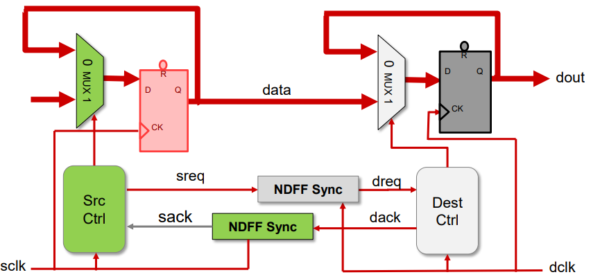

**Asynchronous FIFO**：用 dual-port RAM，一邊用 write clk 寫、一邊用 read clk 讀；read/write pointer 用 **gray code** 互相同步比較產生 full / empty 旗標。

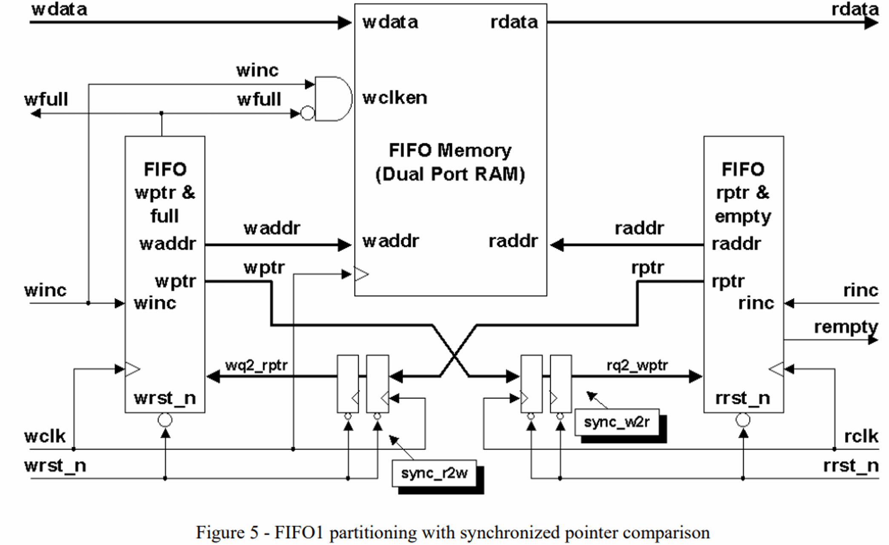

- **指標要多一個 bit**：深度 `2^n` 的 FIFO 用 **n+1 bit 指標**，多出的最高位用來區分「滿」與「空」（兩者低位都相同，差在 MSB）：
  - `empty： waddr == raddr`（完全相同）
  - `full ： waddr == {~raddr[MSB], raddr[lower]}`（低位相同、MSB 相反）
- 跨域比較時：TX 端用「rx 指標同步過來的 gray 值」算 full；RX 端用「tx 指標同步過來的 gray 值」算 empty。

> **CDC 失敗波形題（2022 Q9）**：要畫出來源資料 adat 在目標 bclk 邊緣附近改變 → 違反 setup/hold → bdat1 取到亞穩/錯值。重點是讓 adat 的轉態剛好對齊 bclk 上升緣。

## H. Microcode FSM

- 用 **ROM** 實作 FSM：**address = {現態 state, 輸入 input}**，**data = {次態 next state, 輸出 output}**。
- next state 經 register 回授當下一輪 address 高位。
- **縮小 memory 方法**：①把 output 與 next-state 分開存（Moore output 只用 state 定址）②用 **instruction + program counter** 取代狀態列舉（microsequencer）③state/output 編碼壓縮、只存有效列。

## I. FPGA vs ASIC / valid-ready

- **FPGA**：可重組、NRE 低、上市快、單顆貴、功耗高/效能較低 → 少量、原型。
- **ASIC**：光罩 NRE 高、固定不可改、效能/功耗/面積佳、量大才划算。
- **valid-ready handshake**：`valid && ready` 同時為 1 的 clock 邊緣才成功傳一筆。
- **簡化**：拿掉 ready（接收端永遠 ready）→ valid-only；或反之只留 ready。

---

# 二、2022 期末考逐題（共 100 分；⊳為推導解析）

### Part I 實作觀念（46%）

**Q1 Pipeline（8%）** — CL1~4 delay = 3/2/2/6 ns，A/B/C 為三個可插點。

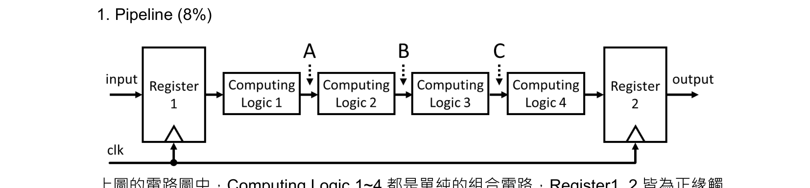

- (a) 最佳單一插點？⊳ **C**。各方案最長 stage：A→max(3,10)=10、B→max(5,8)=8、C→max(7,6)=**7**。C 最平衡 → cycle time 最短。
- (b) A、C 兩處都插，最短 cycle time？⊳ 三段 = {CL1=3, CL2+CL3=4, CL4=6} → **6 ns**（題目只看 CL delay）。
- (c) (b) 的 throughput？運算量 45/40/50/60。⊳ 每筆共 195 operations、每 6 ns 出一筆 → **195 / 6 ns ≈ 32.5 G operations/s**（或每秒輸出 1/6ns ≈ 166.7M 筆）。
- (d) 一組 vs 兩組 register 誰 throughput 高？⊳ **兩組**。cycle time 6ns < 7ns，瓶頸段更短 → throughput 更高。

**Q2 Block diagram & Timing Report（20%）** — 給一段 RTL（兩個累加器 data_0/data_1，依 in_sel 選一個累加 in_data，out_data = data_sel + in_data）。

圖例（adder / multiplexer / DFF）：


題目 RTL：

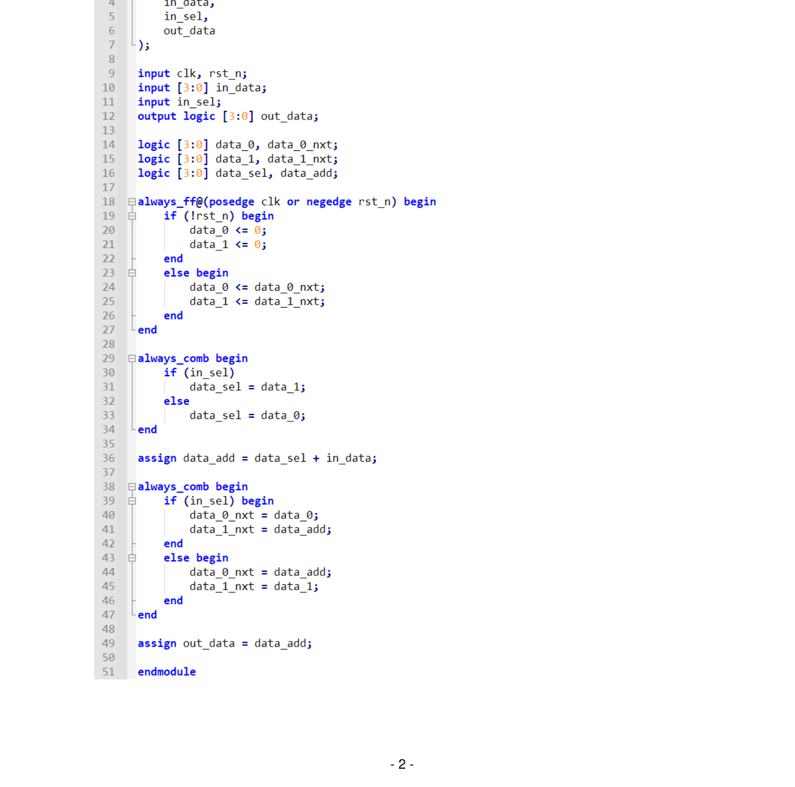

(b) 的 timing report：

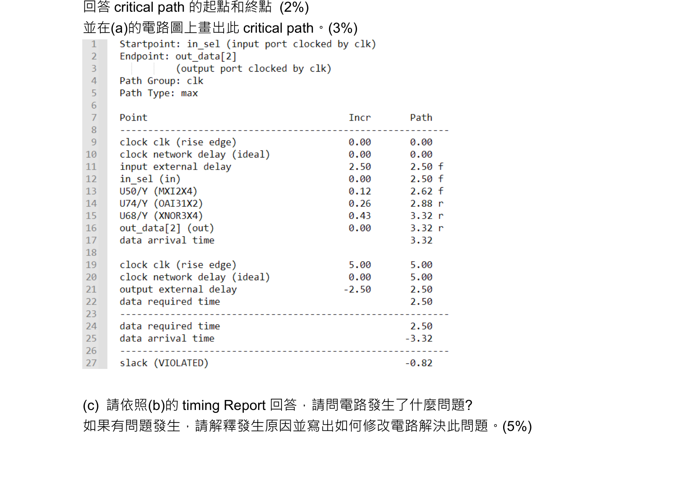

- (a) 用 adder/mux/comparator/DFF 畫 block diagram（10%）。⊳ 重點：in_sel 控制兩顆 DFF 的 feedback MUX 與 data_sel MUX；adder 算 data_add；out_data 直接接 data_add。
- (b) critical path 起點/終點（2%）+ 畫在圖上（3%）。⊳ 報告寫明 **Startpoint: in_sel（input port）→ Endpoint: out_data[2]（output port）**；路徑 in_sel → MUX → adder → out_data。
- (c) 電路有何問題、原因、如何修（5%）。⊳ **slack = −0.82 → setup time violation**。原因：**input→output 為純組合路徑且輸出未暫存**（out_data 是 combinational assign），加上 in/out external delay 後留給邏輯的時間不足。修法：**把輸出暫存（加 output register）/ 切 pipeline / 減少邏輯**，使其變 reg-to-reg。

**Q3 Waveform（18%）** — 給 Pattern + Design（FSM：IDLE/DECODE/ALU1/ALU2，data_nxt 依狀態做 in_data / ×3 / +3 等），畫 rst_n、in_valid、in_data、cs、ns、data_reg（各 3%）。

題目 Pattern（左）與 Design（右）：

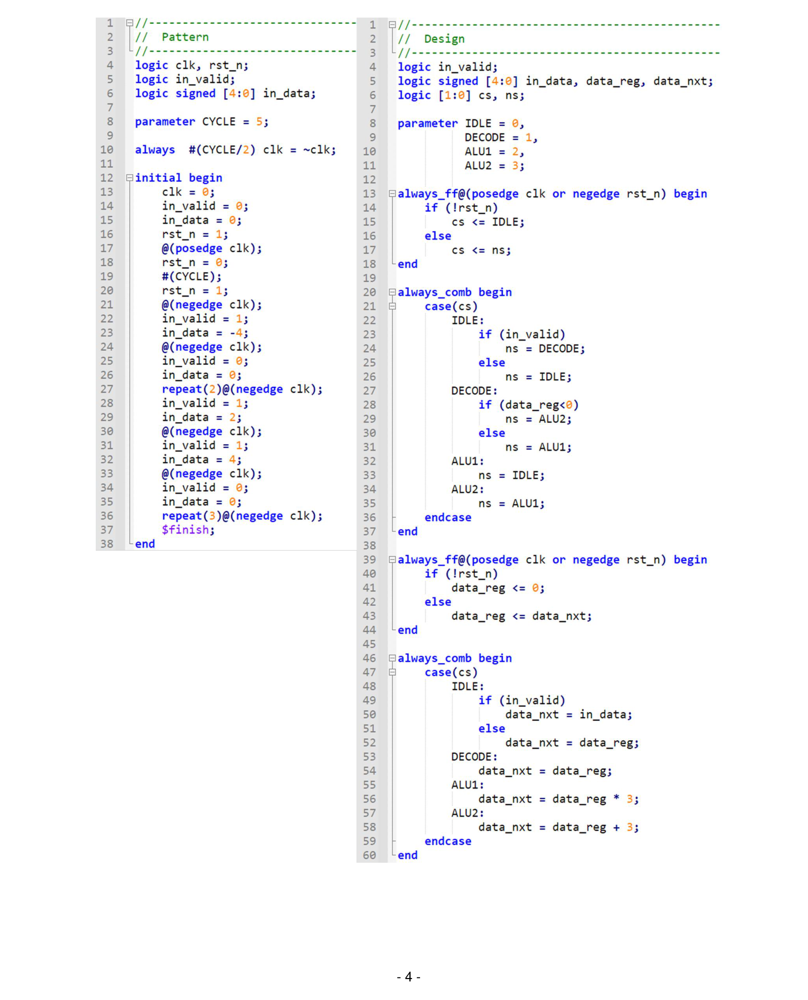

畫法範例（1-bit / multi-bit）與要填的空白波形格：

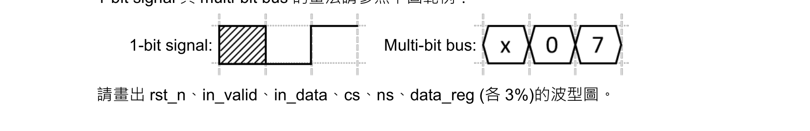

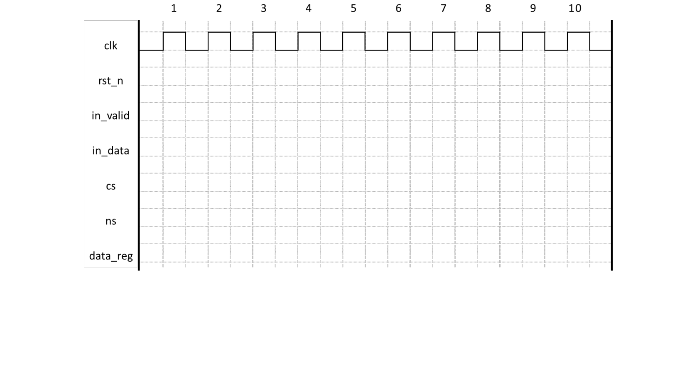

- ⊳ 方法：(1) 先依 Pattern 排出每個 negedge 的 in_valid/in_data；(2) cs 在 posedge 更新 = 前一刻 ns；(3) 注意 `cs<=IDLE` 由 rst_n 非同步；(4) 有號數用 2's complement 標十進位；(5) `repeat(n)@(negedge)` 展開週期數。需逐 cycle 手算 FSM 轉移。

### Part II 基本觀念（23%）

- **Q4（3%）** FPGA vs ASIC 兩點差異 → 見上「知識點 I」。
- **Q5（3%）** valid-ready 波形說明 → `valid&&ready` 同時 high 才傳；列 clock/data/valid/ready。
- **Q6（3%）** 簡化 valid-ready → 拿掉 ready 變 valid-only（或反向）。
- **Q7（3%）** 16K×4 SRAM 做 64-bit 輸出 → **16 顆並聯**（64/4），共用 14-bit address，輸出拼接。
- **Q8（3%）** 支援 3 組同時讀寫、每組 4-bit → 多 port 記憶體：以複製/分 bank + MUX 路由三組 address/data。
- **Q9（4%）** adat 跨 aclk→bclk 失敗波形 → adat 在 bclk 邊緣附近變動，bdat1 取到亞穩/錯值（列 aclk/adat/bclk/bdat1）。

  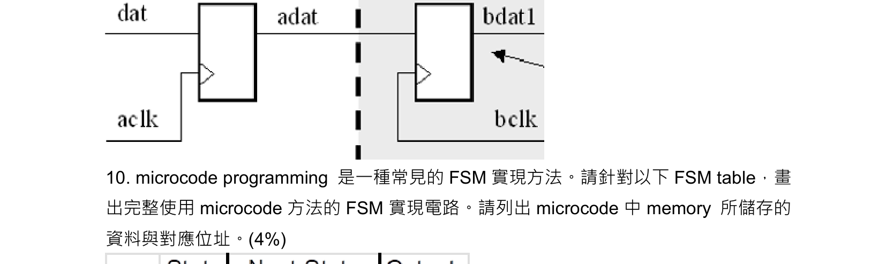

- **Q10（4%）** Microcode FSM（gns/yns/gew/yew 號誌機）→ ROM：address={state, input(lc)}，data={next state, output 6-bit}。逐列列出位址與資料。

  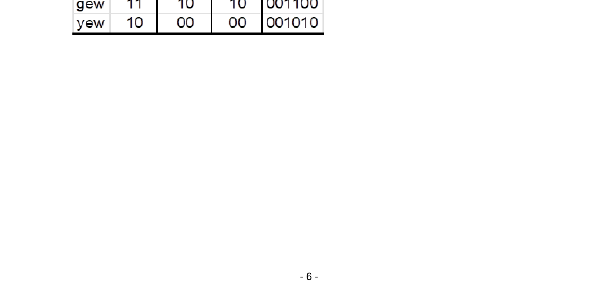

### Part III Design problem（31%）

**Q11 Pipelining & parallelism（18%）** — HD media chip，2000×1000 @100Hz，單 module 處理 1 pixel 需 10µs，t_reg=0。
- (a) 需要的 throughput？⊳ 2000×1000×100 = **2×10⁸ pixels/s**。
- (b) 單一長 pipeline 能達標嗎？需幾級？⊳ pipeline throughput = 1/t_reg... 但每級至少要能每 (1/2e8 s = 5ns) 出一筆。單一 pipeline throughput 上限受最慢級限制；10µs 切成 N 級每級 10µs/N，要 ≤5ns → N ≥ 2000 級。⊳ 理論可行但級數巨大。
- (c) 為何 (b) 是壞主意？⊳ 級數太多 → register 面積/功耗暴增、latency = N×5ns 很大、設計不切實際。
- (d) 改用複製整個 module 要幾份？⊳ 每份 10µs 處理一筆，需 throughput 2e8/s → **需 2×10⁸ × 10µs = 2000 份**。
- (e) 為何也是壞主意？⊳ 2000 份完整 module → 面積/功耗/成本爆炸。
- (f) 改用「複製的 10 級 pipeline」要幾份？⊳ 每份 10 級、每級 1µs、每 1µs 出一筆 → 單份 throughput 1e6/s；需 2e8/s → **200 份**。

**Q12 Setup/Hold violation（13%）** — DFF A：t_s=20, t_h=30, t_ccq=10, t_pcq=20（ps），2GHz（T_c=500ps）。三條路徑 Logic A/B/C（tc/td 見表）。

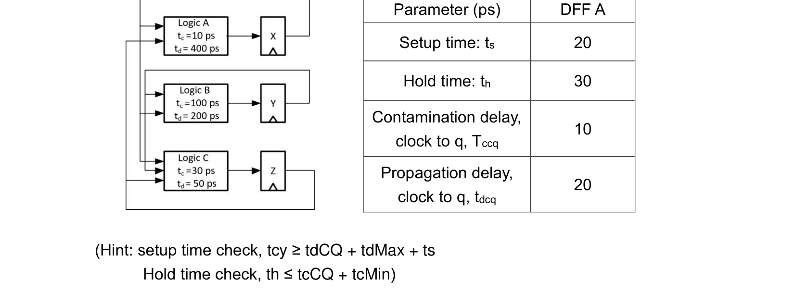
- (a) 哪裡要加 delay？⊳ Hold check：`t_ccq + t_cd ≥ t_h=30`。最短路徑 Logic C：10+30=40≥30 OK；Logic A：10+10=20 < 30 → **A→X 違反 hold**，需加 delay。
- (b) 需加多少 delay？⊳ 補到 `10 + (10+Δ) ≥ 30` → **Δ ≥ 10ps**。
- (c) 重檢 setup、能否更快？⊳ Setup：`T_c ≥ t_pcq + t_pd(max) + t_s`。最大 td=400(Logic A)：20+400+20=440ps（加 hold 修正的 10ps→ 20+410+20=450ps）。⊳ 最快 cycle time ≈ **450ps（> 2GHz 可，約 2.22GHz）**。

---

# 三、2025 期末考逐題 + 官方解答（共 100 分）

**Q1 Pipeline & parallel（10%）** — 三段 A/B/C latency = 8/16/4 cycles。
- (a) 畫 4 筆連續輸入 pipeline diagram + utilization。**Ans：A=50%、B=100%、C=25%**（瓶頸 B=16，每 16 cycle 收一筆；圖中每格=4 cycles）。
- (b) 用**最少 stage** 同時讓 utilization 最大？**Ans：A 切 2 段（8→4/4）、B 切 4 段（16→4×4）、C 不切（4）**，全部 4 cycles → 100%，共 7 級。
- (c) B 變動延遲（input=1→16cyc, 0→4cyc），序列 1010 畫 pipeline diagram。**Ans：會 stall，需畫出氣泡**。
- (d) 如何防 stall？**Ans：加 FIFO 緩衝 / 複製 B 硬體**，給合理方法 + block diagram。

官方解答 pipeline diagram（(a) utilization、(b) 切法、(c) stall）：

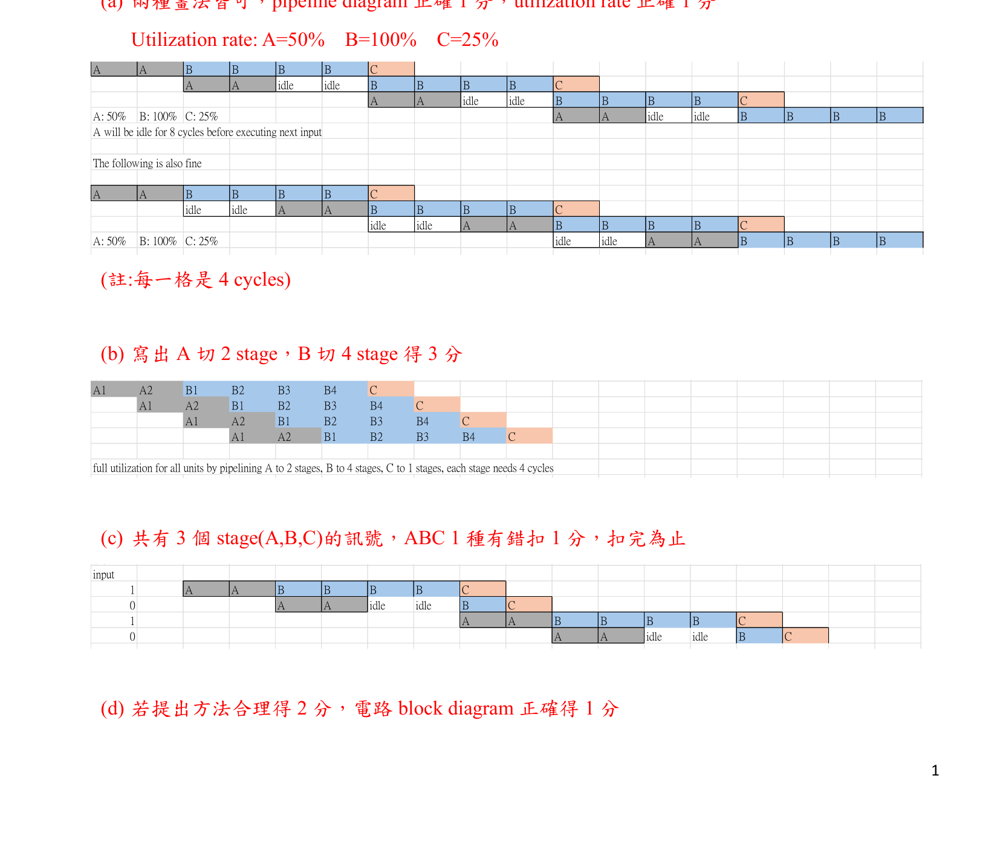

**Q2 Timing path a~e（10%）** — 由 timing report 畫 reg-to-reg 五段。

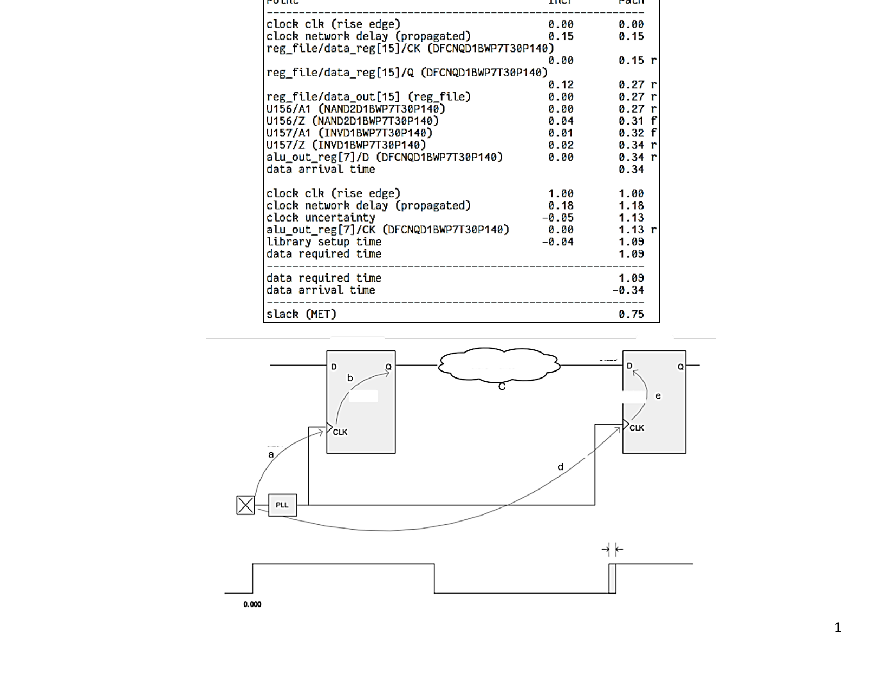

**Ans：a=0.15（launch clk network）、b=0.12（CK→Q）、c=0.07（組合邏輯）、d=0.18（capture clk network）、e=0.04（library setup time）**。

**Q3 Microcode FSM（10%）**

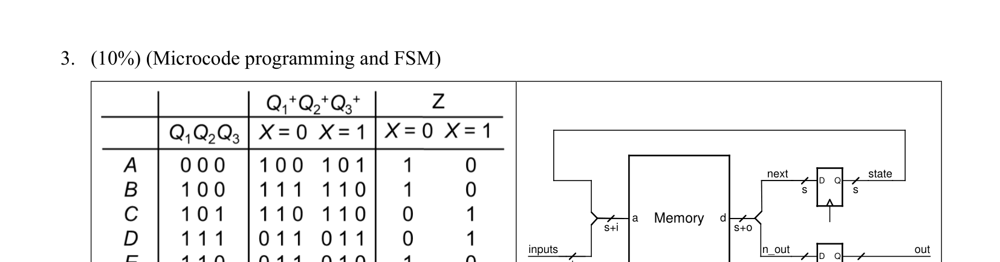

- (a) 列 ROM 內容，**address = {Q1,Q2,Q3,X}（4-bit）→ data = {Q1⁺,Q2⁺,Q3⁺,Z}**：

  | Addr | Data | Addr | Data |
  |------|------|------|------|
  | 0000 | 1001 | 1000 | 1111 |
  | 0001 | 1010 | 1001 | 1100 |
  | 0010 | xxxx | 1010 | 1100 |
  | 0011 | xxxx | 1011 | 1101 |
  | 0100 | 0001 | 1100 | 0111 |
  | 0101 | xxxx | 1101 | 0100 |
  | 0110 | 0000 | 1110 | 0110 |
  | 0111 | 0001 | 1111 | 0111 |

  （需完整列 16 條；標 x 的三條可不寫。address/data 未標 bit 排列方式會扣分。）
- (b) state/input 增加時 memory 變大，提兩種縮法。**Ans：①把 state 與 output 分開存；②用 instruction + program counter 取代 state 列舉**（每法 2 分）。

**Q4 Memory usage（10%）** — 基本 1K×8 SRAM。
- (a) 組 1K×32：**4 顆並聯，同 address A[9:0]，輸出拼成 32-bit**。
- (b) 組 4K×8：**4 顆，A[9:0] 進每顆，用 A[11:10] 在輸出端 MUX 選 bank**。
- (c) 組 2K×8 雙 port（一讀一寫/兩讀/兩寫，兩 port 不同 address space）：**用兩塊 1K×8，依 address MSB 用 MUX 把每個 port 路由到對應 bank**；因兩 port 不會同時打同一 bank → 無衝突。需 MUX 路由 address/data + 讀資料 MUX 回兩 port。

官方解答 (a)(b) 與 (c) block diagram：

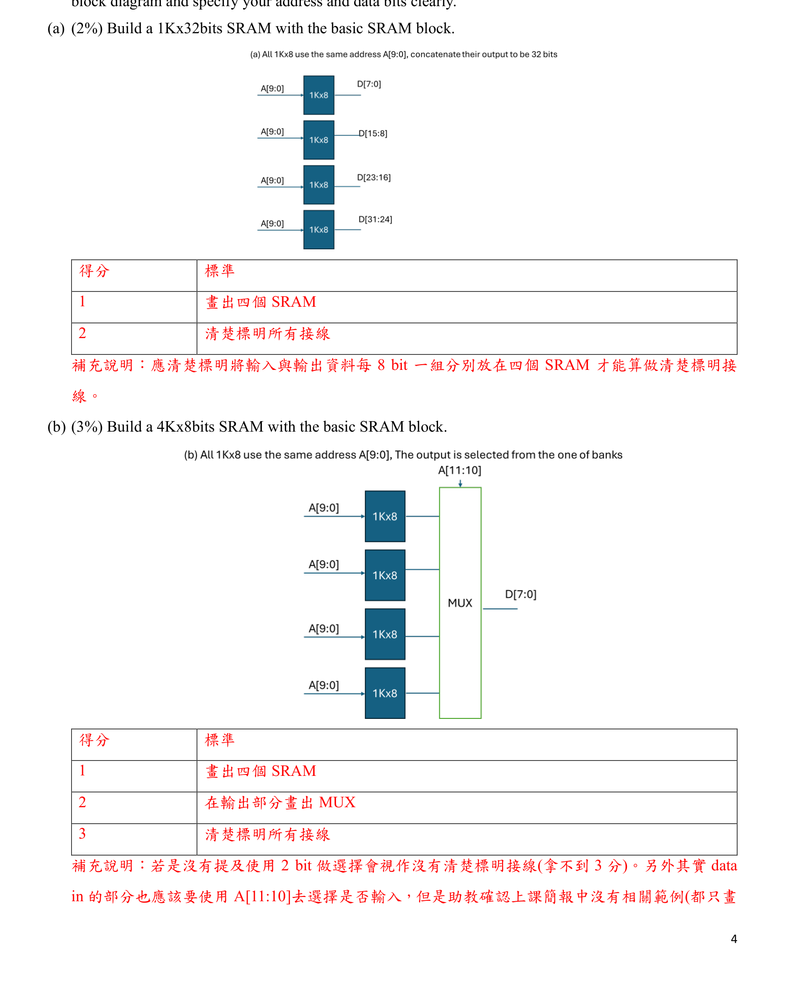

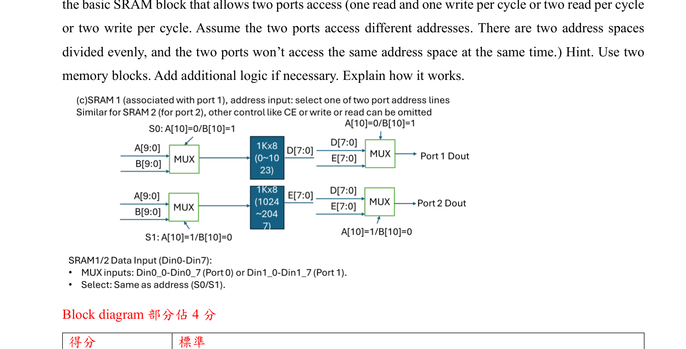

**Q5 Metastability & Synchronizer（10%）** — 完整觀念與圖見上方 **「一、知識點 G」**（含 Lab09 圖）。
- (a) **metastability 定義**：當 FF 取樣的資料違反 setup/hold（在 window 內跳變），輸出進入既非 0 也非 1 的不穩定態，需經一段**不確定長度的時間**才 resolve 到 0/1（可能還是錯值）。→ 詳見 G-2。
- (b) **為何 2-FF 能防**：第一級 FF 取到 CDC 訊號雖可能亞穩，但到第二級之間有**將近一整個 clock cycle 讓它 resolve**；第二級取樣時幾乎必為穩定值，使亞穩態傳到下游的機率（MTBF 公式中 t_r 變大 → 指數下降）降到極低。→ 詳見 G-3。
- (c) **為何 Gray code 適合多 bit 跨域**：相鄰碼**只差 1 bit**；即使取樣落在轉態瞬間，最多 1 個 bit 不確定，結果非舊值即新值（最多差 1），**不會出現多 bit 同時變造成的錯誤中間值（convergence 問題）**。→ 詳見 G-4。

**Q6 Jerry SystemVerilog（12%）** — 八個 8-bit 輸入分兩組各 4 個相加再相乘；4ns clock，slack=0.01。

block diagram 與 timing report：

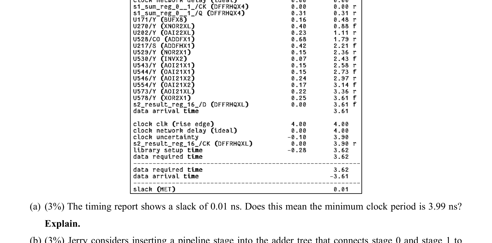

- (a) slack 0.01 → 最小週期是 3.99ns 嗎？**Ans：不能（不對）**。合成在更緊 constraint 下會換不同硬體/架構，最小週期通常**還能更低**，不能直接用 4−0.01 推；且 slack>0 幾乎必有優化空間（不接受「小數點精確度」鑽牛角尖式回答）。
- (b) 在 stage0↔stage1 的 adder tree 插 pipeline 能降週期嗎？**Ans：不能**。**critical path 在 s1→s2（乘法器）之間，不在 s0→s1**，縮 s0→s1 無效。
- (c) reset 測試 task 的問題？**Ans：應用 `!==` 而非 `!=`**。`!=` 無法偵測 unknown（X）；訊號為 X 時會偵測不到錯誤。

  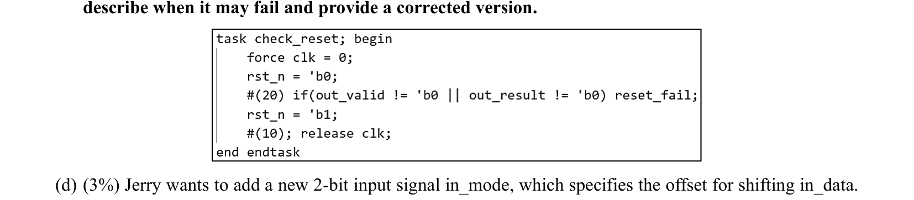

- (d) 加 in_mode 做 circular shift，Tom vs Jerry 哪個面積小？

  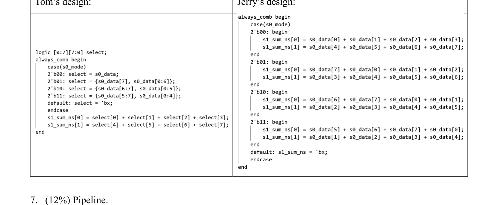**Ans：Tom 較小**。Jerry 在 4 種 mode 各開一套加法硬體（4 套）；Tom 先用 MUX 選資料、只保留一套加法器 → 面積較小。（參考面積 Tom≈25181、Jerry≈32941）

**Q7 Pipeline（12%）** — CL1~4 delay=3/5/7/1 ns，setup=1ns、hold=0，A/B/C 三插點。

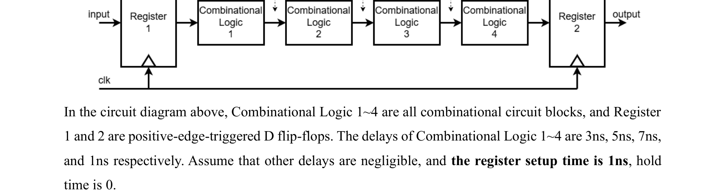
- (a) 最佳插點？**Ans：B**（cycle time 最小、throughput 最大）。各方案最低 cycle time（含 setup 1ns）：
  - 切 A：max(3, 5+7+1)+1 = **14ns**
  - 切 B：max(3+5, 7+1)+1 = **9ns** ✅ 最平衡
  - 切 C：max(3+5+7, 1)+1 = **16ns**
- (b) (a) 後最短 cycle time？**Ans：9ns**（兩段各 8ns 邏輯 + 1ns setup = 9ns）。
- (c) pipeline 前/後 throughput？
  - 前：cycle = 3+5+7+1 + 1(setup) = **17ns** → throughput = 1/17ns ≈ **58.82 MOPS**
  - 後：cycle = **9ns** → throughput = 1/9ns ≈ **111.11 MOPS**
- (d) latency 會變短嗎？**Ans：不會**。latency 是輸出總時間，pipeline 後 latency 反而**增加或不變**（級數×cycle time）。
- (e) 能否再加一個 register 進一步提升 throughput？**Ans：不能**。切 B 後**兩段都是 8ns（兩個並列 critical path）**，且 CL3=7ns 為不可分割的單一 block；再把 register 擺 A 或 C 只能切開其中一段，另一段 8ns 仍在 → cycle time 卡在 9ns 無法下降。

**Q8 Waveform（14%）** — FSM：IDLE/DIN/COM1/COM2/OUT，out_num 在 COM1 做 +2、COM2 做 >>1，in_reg 有號。

題目 Pattern（左）+ Design（右）與要填的空白格：

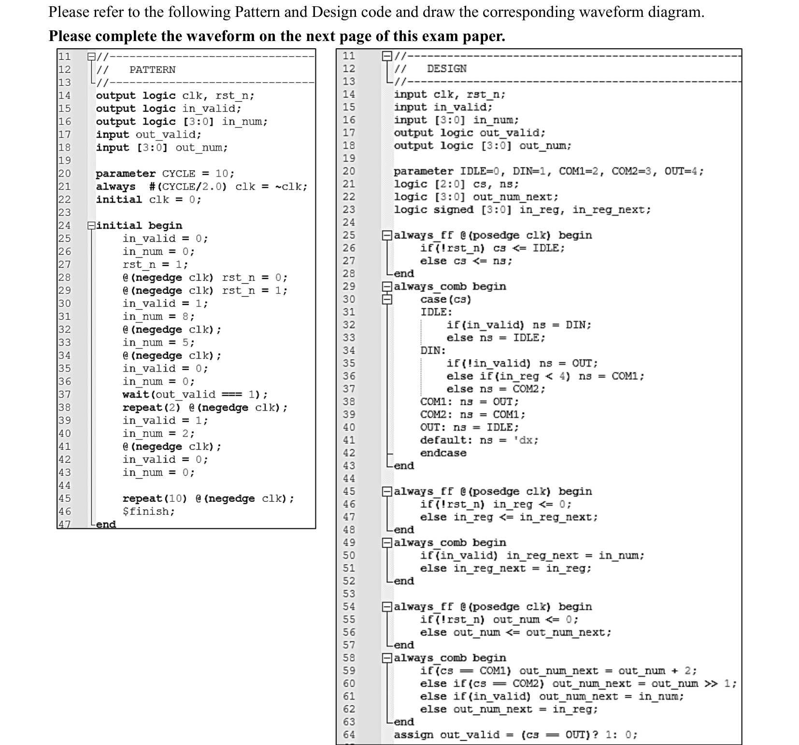

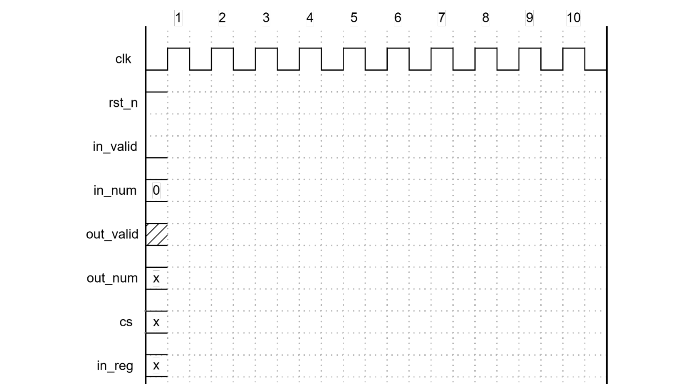

**Ans 波形（10 cycle）**：

| cycle | 1 | 2 | 3 | 4 | 5 | 6 | 7 | 8 | 9 | 10 |
|-------|---|---|---|---|---|---|---|---|---|----|
| in_num | 0 | 8 | 5 | 0 | 0 | 2 | 0 | 0 | 0 | 0 |
| out_num | x | 0 | 8 | 5 | 7 | 5 | — | 2 | — | — |
| cs | x | 0 | 1 | 2 | 4 | 0 | 1 | 4 | 0 | — |
| in_reg | x | 0 | −8 | — | 5 | — | — | 2 | — | — |

官方解答波形：

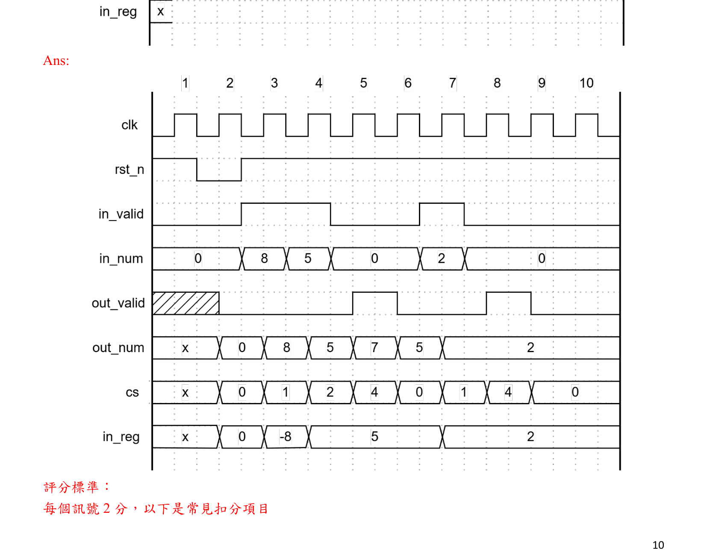

（評分每訊號 2 分。常見扣分：in_reg=−8 寫成 output 錯/晚一 cycle；out_valid 高的 cycle 沒對；第二筆 input 跳錯導致輸出錯；reset 在 posedge 變動。）

**Q9 Setup/Hold（12%）** — DFF A：t_setup=30, t_hold=35, t_ccq=10, t_pcq=20（ps），2GHz（T_c=500ps）。Logic A/B/C：tc=10/100/30, td=400/200/50 ps。

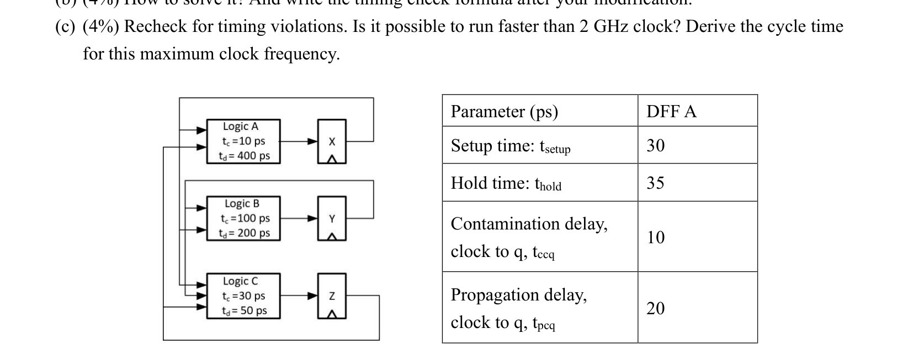
- (a) 有無 violation？**Ans：Hold violation @ A→X**。`t_hold ≤ t_ccq + t_cd` → `35 ≤ 10 + 10 = 20` **違反**。（Setup：T_c=500 ≥ 20+400+30=450 OK，無 setup violation。）
- (b) 如何解？**Ans：在 Logic A 加 15ps delay**，使 `35 ≤ 10 + (10+15)=35` 成立。（沒寫不等式 / 解法錯 / 數字錯 扣 2 分。）
- (c) 重檢、能否更快？**Ans：加 15ps 後 setup：`T_c ≥ t_pcq + t_pd + t_setup + 15 = 20+400+30+15 = 465ps`** → 最快 ≈465ps（>2GHz，約 2.15GHz）。

---

# 四、考前衝刺重點（最容易考 & 最容易錯）

1. **Setup/Hold 公式方向別記反**：setup 決定**最快 clock**（`T_c ≥ t_pcq+t_pd+t_setup`）；hold 與 clock 無關（`t_ccq+t_cd ≥ t_hold`），違反就在**最短路徑**加 delay。
2. **Pipeline latency 不會變短**——只提升 throughput；考題每年都問，標準答案一律「不變或變長」。
3. **切 register = 平衡各 stage**，cycle time = 最長段 + setup。
4. **slack≠最小週期−slack**：最小週期要重新合成，通常更低。
5. **Waveform**：cs 在 posedge 更新（=上一 ns）、非同步 reset、有號數用 2's complement、`repeat(n)` 要展開、輸出比輸入晚一級。
6. **SRAM**：加寬=並聯拼接、加深=高位選 bank、多 port=分 bank+MUX。
7. **CDC（必考）**：metastability 定義（不確定時間 resolve）→ 2-FF synchronizer 給近一 cycle resolve 提升 MTBF（只適用單 bit）→ 多 bit 用 Gray code（只變 1 bit，避開 convergence 錯誤中間值）→ handshake（低 latency 慢）vs async FIFO（高 throughput、gray pointer、n+1 bit 指標分滿/空）。細節見知識點 G。
8. **Microcode**：address={state,input}、data={next state,output}；縮 memory=分存 output / 用 PC+instruction。
9. **Verilog 驗證細節**：比較含 X 要用 `===`/`!==`，不可用 `==`/`!=`。
10. **面積比較**：用 MUX 提前選資料（共用一套運算）比每個 mode 各開一套硬體小。

---
*整理時間：2026-06-08*
